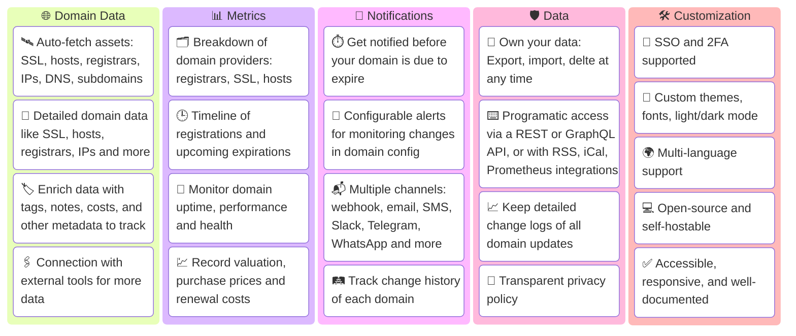

<h1 align="center">Domain Locker</h1>
<p align="center">
	<i>The Central Hub for all your Domain Names</i>
  <br>
  <b>🌐<a href="https://domain-locker.com">domain-locker.com</a></b>
</p>
<p align="center">
  
</p>

<!-- 
<p align="center">
  <a href="https://artifacthub.io/packages/helm/domain-locker/domain-locker">
    
  </a>
  <a href="https://hub.docker.com/r/lissy93/domain-locker">
    
  </a>
  <a href="https://apps.umbrel.com/app/domain-locker">
    
  </a>
  <a href="https://community-scripts.github.io/ProxmoxVE/scripts?id=domain-locker">
    
  </a>
  
  
  
</p>
-->

## About

The aim of Domain Locker, is to give you complete visibility of your domain name portfolio, in once central place.

For each domain you add, we analyse it and fetch all associated data. We then continuously monitor your domains, and notify you (according to your preferences) when something important changes or when it's soon to expire. So you'll get detailed domain analysis, security insights, change history, recent performance, valuation data and much more.

With Domain Locker, you'll never again loose track of your domains, miss an expiration, or forget which registrar and providers each domain uses.

### Screenshot

<p align="center">

</p>

<details>
<summary>More screenshots...</summary>
<p align="center"><sup>(Sorry about the 5fps, I wanted to keep file size down!)</sup></p>
<p align="center">
<br>


</p>
</details>


### Features

- 👁️ Total visibility of all your domains and upcoming expirations
- 📡 Auto-fetched data: SSL certs, hosts, registrars, IPs, subdomains, DNS, etc
- 🔬 View detailed metrics and analysis for each domain
- 📊 Visual analytics and breakdowns and trends across your portfolio
- 💬 Configurable alerts and webhook notifications
- 🗃️ Easy import/export, as well as API data access
- 📜 Track changes in domain configuration over time
- 📈 Monitor website health, security and performance
- 💹 Keep record of purchase prices and renewal costs
- 🔖 Add categories, and link related resources to domains
- 🎨 Multi-language support, dark/light/custom themes

<details>
<summary>More features...</summary>



</details>

### Demo

Try the live demo to [demo.domain-locker.com](https://demo.domain-locker.com) <br>
(Username: `demo@domain-locker.com` Password: `domainlocker`)

---

## Get Started

To use Domain Locker, you have two options:
1. 💻 The managed instance, at **[domain-locker.com](https://domain-locker.com/)** _(free)_
2. 🏗️ Or **[self-hosting](#deployment)** yourself via Docker _(also free, ofc!)_

### Option 1: Domain-Locker.com
Head to [our website](https://domain-locker.com), and sign up with Google, GitHub or your email.<br>
The starter plan is free, and no setup is required. Just sign in, add your domains, and start tracking them.

### Option 2: Self-Hosting

```bash
docker run -p 3000:3000 -v domain-locker-data:/data lissy93/domain-locker
```

Or use the [`docker-compose.yml`](https://github.com/Lissy93/domain-locker/blob/main/docker-compose.yml)

<details>
	<summary>Details</summary>

 
- **Prerequisites**:
  - Domain Locker is intended to be run in a container, so you'll need Docker [installed](https://docs.docker.com/engine/install/) on your host system.
- **Containers**:
  - We have a Docker image published to [`lissy93/domain-locker`](https://hub.docker.com/r/lissy93/domain-locker).
  - That's all you need. Data is stored in a SQLite file, or in Postgres if you'd rather run one.
- **Environment**:
  - When starting the container, bind `3000` in the container, to your host `PORT` (defaults to `3000`).
  - Nothing else is required. For Postgres, also specify `DL_PG_HOST`, `DL_PG_PORT`, `DL_PG_USER`, `DL_PG_PASSWORD` and `DL_PG_NAME`.
- **Volumes**:
  - Mount a volume to `/data` to persist your data
- **Crons**
  - The app schedules these itself:
  - `/api/domain-updater` - Runs daily, to keep domain data up-to-date and trigger notifications
  - `/api/domain-monitor` - Runs every 15 minutes, to monitor website uptime and performance
  - `/api/cleanup-monitor-data` - Runs weekly, to aggregate old monitoring data
- **Example**:
  - Putting it all together, you can use our [`docker-compose.yml`](https://github.com/Lissy93/domain-locker/blob/main/docker-compose.yml) file.
  - For more details, view the [Self-Hosting Docs](https://domain-locker.com/about/self-hosting)

 
</details>


### Option 3: Unofficial Apps

- [](https://artifacthub.io/packages/helm/domain-locker/domain-locker)
- [](https://hub.docker.com/r/lissy93/domain-locker)
- [](https://apps.umbrel.com/app/domain-locker)
- [](https://github.com/Lissy93/dl-sb-iac)
- [](https://community-scripts.github.io/ProxmoxVE/scripts?id=domain-locker)
- [](https://apps.truenas.com/catalog/domain-locker/)
- [](https://domain-locker.com/about/self-hosting/deploying-on-easypanel-io) _(Pending)_
- [](https://domain-locker.com/about/self-hosting/deploying-on-unraid) _(Planned)_


---

## Developing

#### Project Setup

> See the [Developing Docs](https://domain-locker.com/about/developing) for more info

```bash
git clone git@github.com:Lissy93/domain-locker.git    # Get the code
cd domain-locker                                      # Navigate into directory
npm install --legacy-peer-deps                        # Install dependencies
cp .env.example .env                                  # Set environmental variables
npm run dev                                           # Start the dev server
```

---

## Attributions

##### Contributors


##### Sponsors


---

## License


> _**[Lissy93/Domain-Locker](https://github.com/Lissy93/domain-locker)** is licensed under [MIT](https://github.com/Lissy93/domain-locker/blob/HEAD/LICENSE) © [Alicia Sykes](https://aliciasykes.com) 2025._<br>
> <sup align="right">For information, see <a href="https://tldrlegal.com/license/mit-license">TLDR Legal > MIT</a></sup>

<details>
<summary>Expand License</summary>

```
The MIT License (MIT)
Copyright (c) Alicia Sykes <alicia@omg.com> 

Permission is hereby granted, free of charge, to any person obtaining a copy 
of this software and associated documentation files (the "Software"), to deal 
in the Software without restriction, including without limitation the rights 
to use, copy, modify, merge, publish, distribute, sub-license, and/or sell 
copies of the Software, and to permit persons to whom the Software is furnished 
to do so, subject to the following conditions:

The above copyright notice and this permission notice shall be included install 
copies or substantial portions of the Software.

THE SOFTWARE IS PROVIDED "AS IS", WITHOUT WARRANTY OF ANY KIND, EXPRESS OR IMPLIED,
INCLUDING BUT NOT LIMITED TO THE WARRANTIES OF MERCHANT ABILITY, FITNESS FOR A
PARTICULAR PURPOSE AND NON INFRINGEMENT. IN NO EVENT SHALL THE AUTHORS OR COPYRIGHT
HOLDERS BE LIABLE FOR ANY CLAIM, DAMAGES OR OTHER LIABILITY, WHETHER IN AN ACTION
OF CONTRACT, TORT OR OTHERWISE, ARISING FROM, OUT OF OR IN CONNECTION WITH THE
SOFTWARE OR THE USE OR OTHER DEALINGS IN THE SOFTWARE.
```

</details>

<!-- License + Copyright -->
<p  align="center">
  <i>© <a href="https://aliciasykes.com">Alicia Sykes</a> 2025</i><br>
  <i>Licensed under <a href="https://gist.github.com/Lissy93/143d2ee01ccc5c052a17">MIT</a></i><br>
  <a href="https://github.com/lissy93"></a><br>
  <sup>Thanks for visiting :)</sup>
</p>

<!-- Dinosaurs are Awesome -->
<!-- 
                        . - ~ ~ ~ ~ - .
      ..     _      .-~                 ~-.
     //|     \ `..~                        `.
    || |      }  }                /       \  \
(\   \\ \~^..'                   |         }  \
 \`.-~  o      /       }         |        /    \
 (__          |       /          |       /      `.
  `- - ~ ~ -._|      /_ - ~ ~ ~ ^|      /- _      `.
              |     /            |     /     ~-.     ~- _
              |_____|            |_____|         ~ - . _ _~_-_
-->
