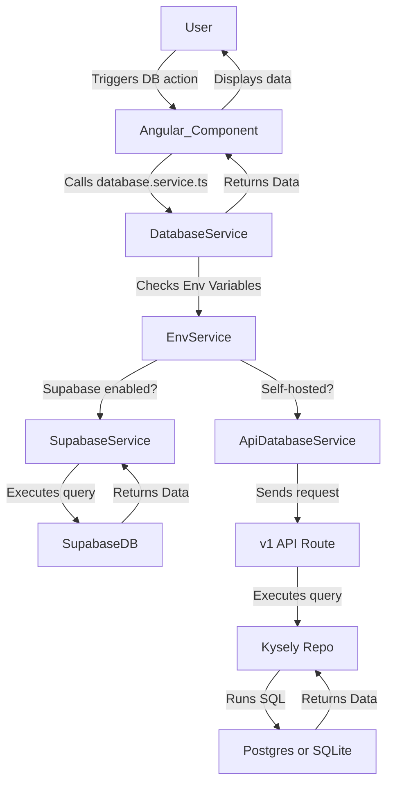

Domain Locker supports **Supabase**, **PostgreSQL** and **SQLite** as database backends. The application dynamically selects which to use based on the configured environment variables. This guide explains how the database integration works, the request flow, and how to interact with the database.

### Database Options

Domain Locker determines the database type by checking the available environment variables:
- If **PostgreSQL** credentials (`DL_PG_HOST`, `DL_PG_USER`, etc.) are set, it will use PostgreSQL.
- Otherwise, if **Supabase** credentials (`SUPABASE_URL`, `SUPABASE_ANON_KEY`) are set, the app uses Supabase.
- With neither configured, it falls back to **SQLite**, which needs no setup at all.
- Managed instances always use Supabase, and ignore the self-hosted options above.

Postgres and SQLite are reached through the server's `/v1` API, so their credentials never leave the server. Supabase is called from the browser, under row-level security.

The entry point for database operations is [`database.service.ts`](https://github.com/Lissy93/domain-locker/blob/main/src/app/services/database.service.ts), which forwards calls to the appropriate database service.

### Database Setup
_(Coming soon...)_

### How the Database Files Fit Together

Database interactions are managed through multiple services:

1. **[`database.service.ts`](https://github.com/Lissy93/domain-locker/blob/main/src/app/services/database.service.ts)**  
   - Determines the active database type (Supabase or self-hosted) and routes calls to the correct sub-service.
2. **[`sb-database.service.ts`](https://github.com/Lissy93/domain-locker/blob/main/src/app/services/db-query-services/sb-database.service.ts)** (for Supabase)  
   - Handles queries using the Supabase client.
3. **[`api-database.service.ts`](https://github.com/Lissy93/domain-locker/blob/main/src/app/services/db-query-services/api-database.service.ts)** (for Postgres and SQLite)  
   - Calls the server's `/v1` API, rather than the database itself.
4. **[`db-query-services`](https://github.com/Lissy93/domain-locker/tree/main/src/app/services/db-query-services/)**  
   - Contains sub-services for specific parts of the app, e.g., tags, domains, billing.
5. **[`db-proxy.factory.ts`](https://github.com/Lissy93/domain-locker/blob/main/src/app/utils/db-proxy.factory.ts)**  
   - Restricts write operations based on feature flags (e.g., disabling edits on a demo instance).
6. **[`routes/v1`](https://github.com/Lissy93/domain-locker/tree/main/src/server/routes/v1)**  
   - The REST endpoints, each wrapped in `defineApiRoute` for auth and validation.
7. **[`db/repos`](https://github.com/Lissy93/domain-locker/tree/main/src/server/db/repos)**  
   - The queries themselves, written with Kysely, and shared by both Postgres and SQLite.

### Request Flow



### Using the Database in Code

#### Writing a New Query (Self-Hosted & Supabase)

To add a new query, define it in the appropriate query service.

For self-hosted, the query lives on the server, and the client just calls the endpoint.

The query in ([`repos/tags.ts`](https://github.com/Lissy93/domain-locker/blob/main/src/server/db/repos/tags.ts))
```ts
async create(tag: TagInput, userId = currentUserId()) {
  return db
    .insertInto('tags')
    .values({ name: tag.name, color: tag.color ?? null, user_id: userId })
    .returningAll()
    .executeTakeFirstOrThrow();
}
```

The endpoint in ([`routes/v1/tags/index.post.ts`](https://github.com/Lissy93/domain-locker/blob/main/src/server/routes/v1/tags/index.post.ts))
```ts
export default defineApiRoute({ write: true, body: tagSchema }, ({ db, body }) =>
  db.tags.create(body),
);
```

And the client call in ([`api-queries.ts`](https://github.com/Lissy93/domain-locker/blob/main/src/app/services/db-query-services/api/api-queries.ts))
```ts
addTag(tag: Omit<Tag, 'id'>): Observable<Tag> {
  return this.api.post<Tag>('/v1/tags', tag);
}
```

Supabase example from ([`db-tags.service.ts`](https://github.com/Lissy93/domain-locker/blob/main/src/app/services/db-query-services/sb/db-tags.service.ts))

```ts
addTag(tag: Omit<Tag, 'id'>): Observable<Tag> {
  return from(this.supabase.from('tags').insert(tag).single()).pipe(
    map(({ data, error }) => {
      if (error) throw error;
      if (!data) throw new Error('Failed to add tag');
      return data as Tag;
    }),
    catchError(error => this.handleError(error))
  );
}
```

#### Consuming a Query in an Angular Component

```diff
  import { Component } from '@angular/core';
  import { CommonModule } from '@angular/common';
+ import DatabaseService from '~/app/services/database.service';

  @Component({
    standalone: true,
    selector: 'app-example',
    template: \`
      <p>Tags: {{ tags | json }}</p>
    \`,
    imports: [CommonModule],
  })
  export class ExampleComponent {
+   tags: any[] = [];

+   constructor(private databaseService: DatabaseService) {}

+   ngOnInit() {
+     this.databaseService.instance.tagQueries.getTags().subscribe((tags) => {
+       this.tags = tags;
+     });
+   }
  }
```

### Additional Notes

- Queries should be **added to the correct query service** ([`db-tags.service.ts`](https://github.com/Lissy93/domain-locker/blob/main/src/app/services/db-query-services/sb/db-tags.service.ts), [`api-queries.ts`](https://github.com/Lissy93/domain-locker/blob/main/src/app/services/db-query-services/api/api-queries.ts), etc.).
- Use **Observables** (`rxjs`) for async operations.
- **Errors should be handled** via `handleError()`, which logs errors and prevents crashes.
- **Every query must exist in both paths**, with a matching signature, since the proxy picks between them at runtime.
- **Server queries must work on both dialects**, so avoid Postgres-only SQL, which SQLite will reject.
- **Use feature flags** to control write operations (see [`db-proxy.factory.ts`](https://github.com/Lissy93/domain-locker/blob/main/src/app/utils/db-proxy.factory.ts)).


