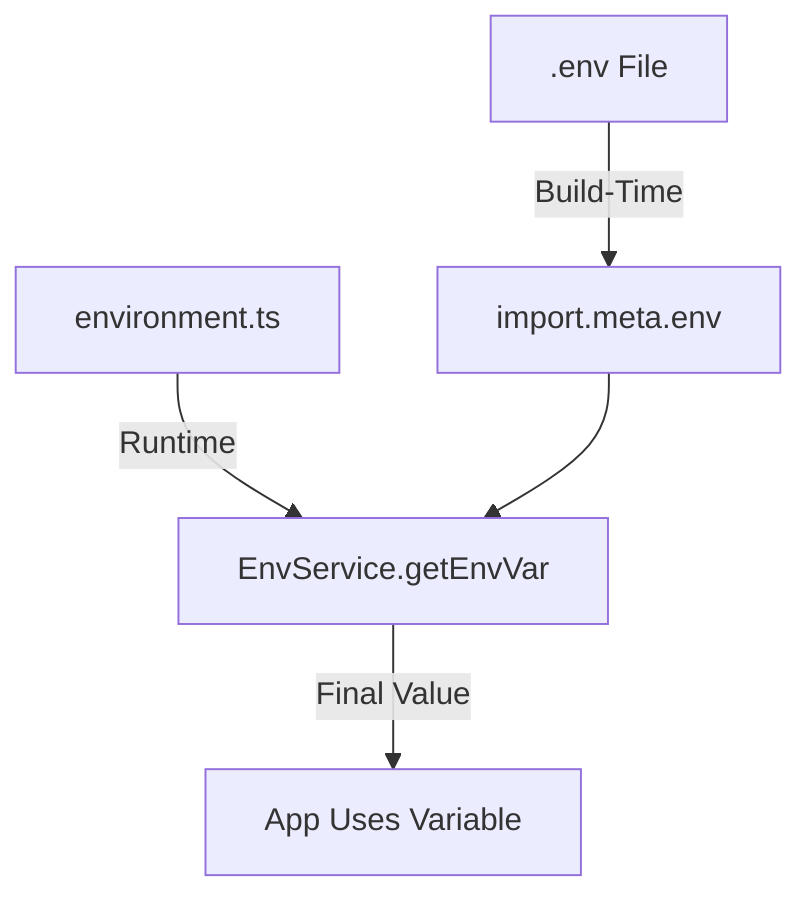

Environment variables allow Domain Locker to be configured dynamically at build-time without modifying the source code. They define settings such as database connections, API keys, analytics, and occasionally feature flags.

The app reads environment variables from:
1. **Runtime variables**, from the process environment or a `.env` file next to the app.
2. **Build-time variables**, baked in from the `.env` present when the app was built.

### How Environment Variables Work

- Only the variables allowlisted in `src/server/utils/client-env.ts` are sent to the browser. Everything else, including `DL_PG_PASSWORD` and `DL_AUTH_PASSWORD`, stays on the server and is never bundled.
- Self-hosted instances serve their allowlisted values from `/api/env-var`, so a prebuilt Docker image is configured entirely at runtime.
- Runtime values win over build-time ones, so an image takes the settings it was started with rather than whatever was in the `.env` when it was compiled.

---

## Setting Environment Variables

There are multiple ways to set environment variables, depending on the environment:

### Using `.env` Files (Local Development)

```bash
DL_ENV_TYPE=dev
SUPABASE_URL=https://xyz.supabase.co
SUPABASE_ANON_KEY=your-anon-key
```

The app reads this file on startup as well as during the build, so the same `.env` works for `npm run dev` and for a built server started with `node dist/analog/server/index.mjs`. Real environment variables take precedence over it.

### Using a Vault (Production)
_For **secure storage**, use HashiCorp Vault, AWS Secrets Manager, or similar:_

```bash
vault kv put secret/domain-locker DL_BASE_URL="https://app.domainlocker.com"
```

### Setting Directly (Docker/Server)
```bash
export DL_ENV_TYPE=managed
export DL_BASE_URL=https://app.domainlocker.com
```

### Setting in CI/CD Pipelines
When deploying, **add environment variables to production, staging, and other environments**.

For GitHub Actions:
```yaml
env:
  DL_ENV_TYPE: production
  DL_BASE_URL: https://app.domainlocker.com
  SUPABASE_URL: ${{ secrets.SUPABASE_URL }}
```

---

## The Env Service

The most important function in the `EnvService` is `getEnvVar`, which retrieves environment variables from **build-time**, **runtime**, or **fallback values**.

```typescript
const value = this.environmentService.getEnvVar('DL_BASE_URL', 'http://localhost:5173');
```

### How It Works
1. Checks the user's own override in local storage, on self-hosted instances.
2. Checks the runtime values fetched from `/api/env-var`.
3. Checks the values baked in at build time.
4. Uses the fallback if none is found, or optionally throws.

### Example: Requiring a Variable

```diff
  import { Component } from '@angular/core';
+ import { EnvService } from '~/app/services/environment.service';

  @Component({
    standalone: true,
    selector: 'app-example',
    template: \`
      <p>API Endpoint: {{ domainSubsEndpoint }}</p>
    \`,
  })
  export class ExampleComponent {
+   constructor(private envService: EnvService) {}

+   domainSubsEndpoint = this.envService.getEnvVar('DL_DOMAIN_SUBS_API', 'https://fallback.example.com');
  }
```

---

## Other Helper Functions for Env Vars

In addition to `getEnvVar`, the `EnvService` provides **specific functions** for commonly used variables:

```typescript
const envType = this.environmentService.getEnvironmentType(); // 'dev', 'managed', etc.
const isSupabaseEnabled = this.environmentService.isSupabaseEnabled(); // true/false
const isSelfHosted = this.environmentService.isSelfHostedDatabase(); // true/false
const plausibleConfig = this.environmentService.getPlausibleConfig(); // { site, url, isConfigured }
```

---

## Environment Type (`DL_ENV_TYPE`)

The **environment type** determines how the app behaves and what features are enabled.

| Value | Description |
|--------|------------|
| `dev` | Development mode, enables debugging, local APIs. |
| `managed` | Hosted SaaS version, includes billing and multi-user features. |
| `selfHosted` | Self-hosted instance, excludes Supabase and external services. |
| `demo` | Read-only mode with pre-filled data. |

This value is used by **FeatureService** to dynamically enable or disable features.

---

## List of Allowed Environment Variables

| Variable | Description | Required? |
|----------|------------|-----------|
| `DL_ENV_TYPE` | The environment type (`dev`, `managed`, `selfHosted`, `demo`). | ✅ |
| `DL_BASE_URL` | Public URL of the instance, used for the sitemap and to allow that origin. The browser always calls the app's own origin, so this never needs to point at the API. | ❌ |
| `SUPABASE_URL` | Supabase project URL. | ❌ (Only for managed) |
| `SUPABASE_ANON_KEY` | Supabase public API key. | ❌ (Only for managed) |
| `DL_SUPABASE_PROJECT` | Supabase project ID. | ❌ |
| `DL_GLITCHTIP_DSN` | GlitchTip DSN (for error tracking). | ❌ |
| `DL_PLAUSIBLE_URL` | Plausible instance URL (for analytics). | ❌ |
| `DL_PLAUSIBLE_SITE` | Plausible site ID. | ❌ |
| `DL_PG_HOST` | PostgreSQL database hostname. | ✅ (Self-hosted) |
| `DL_PG_PORT` | PostgreSQL database port. | ✅ (Self-hosted) |
| `DL_PG_NAME` | PostgreSQL database name. | ✅ (Self-hosted) |
| `DL_PG_USER` | PostgreSQL username. | ✅ (Self-hosted) |
| `DL_PG_PASSWORD` | PostgreSQL password. | ✅ (Self-hosted) |
| `DL_DEMO_USER` | Demo user email. | ❌ (Demo mode only) |
| `DL_DEMO_PASS` | Demo user password. | ❌ (Demo mode only) |
| `DL_DOMAIN_INFO_API` | API endpoint for domain info (`/api/domain-info`). | ✅ |
| `DL_DOMAIN_SUBS_API` | API endpoint for domain subscription data. | ✅ |
| `DL_WHO_DAT_URL` | Base URL of a [who-dat](https://github.com/lissy93/who-dat) instance, used as the first whois fallback (defaults to the public instance). | ❌ |
| `DL_STRIPE_CHECKOUT_URL` | Stripe checkout session creation URL. | ❌ |
| `DL_STRIPE_CANCEL_URL` | Stripe subscription cancellation URL. | ❌ |

---

## How Environment Variables Flow in the App


